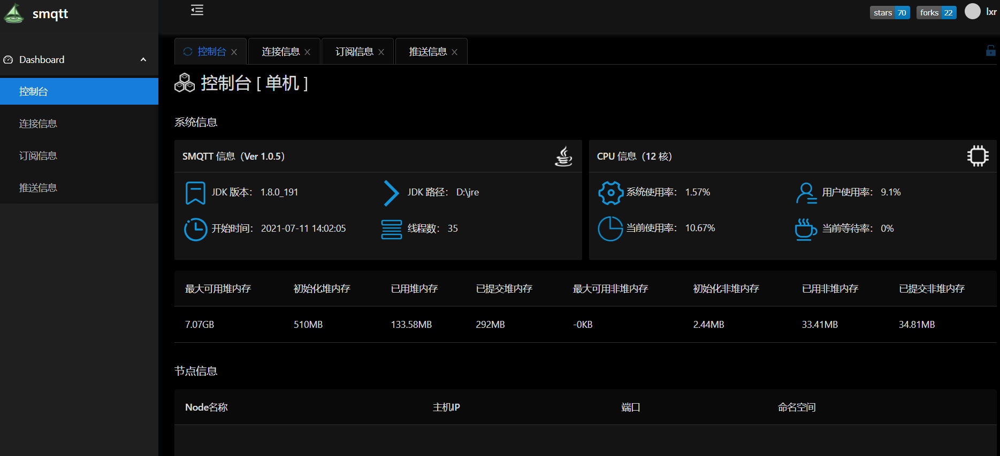

##  SMQTT是一款开源的MQTT消息代理Broker，

SMQTT基于Netty开发，底层采用Reactor3反应堆模型,支持单机部署，支持容器化部署，具备低延迟，高吞吐量，支持百万TCP连接，同时支持多种协议交互，是一款非常优秀的消息中间件！
## smqtt目前拥有的功能如下：


1.  消息质量等级实现(支持qos0，qos1，qos2)
2.  topicFilter支持
    - topic分级（test/test）
    - +支持（单层匹配）
    - #支持（多层匹配）
2.  会话消息
    - 默认内存存储
    - 支持持久化（redis/db）
3.  保留消息
     - 默认内存存储
     - 支持持久化（redis/db）
4.  遗嘱消息
     > 设备掉线时候触发
5.  客户端认证
     - 支持spi注入外部认证
6.  tls加密
     - 支持tls加密（mqtt端口/http端口）
7.  websocket协议支持x
     > 使用websocket协议包装mqtt协议
8.  http协议交互
    - 支持http接口推送消息
    - 支持spi扩展http接口
9.  SPI接口扩展支持
    - 消息管理接口（会话消息/保留消息管理）
    - 通道管理接口 (管理系统的客户端连接)
    - 认证接口 （用于自定义外部认证）
    - 拦截器  （用户自定义拦截消息）
10. 集群支持（gossip协议实现）
11. 容器化支持 
    > 默认镜像最新tag: 1ssqq1lxr/smqtt
12. 持久化支持（session 保留消息）
13. 规则引擎支持(文档需要赞助提供)
13. 管理后台
    > 请参考smqtt文档如何启动管理后台
   

## 尝试一下

> 大家不要恶意链接，谢谢！

|  管理   | 说明  | 其他  |
|  ----  | ----  |----  |
| 123.57.69.210:1883  | mqtt端口 |用户名：smqtt 密码：smqtt |
| 123.57.69.210:8999  | mqtt over websocket |用户名：smqtt 密码：smqtt  |
| http://123.57.69.210:60000/smqtt/admin | 管理后台 |用户名：smqtt 密码：smqtt  |


## main方式启动

引入依赖
```markdown
<!--smqtt依赖 -->
<dependency>
  <groupId>io.github.quickmsg</groupId>
  <artifactId>smqtt-core</artifactId>
  <version>${Latest version}</version>
</dependency>
<!--集群依赖 -->
<dependency>
   <artifactId>smqtt-registry-scube</artifactId>
   <groupId>io.github.quickmsg</groupId>
   <version>${Latest version}</version>
</dependency>
<!--管理ui依赖 -->
<dependency>
   <artifactId>smqtt-ui</artifactId>
   <groupId>io.github.quickmsg</groupId>
   <version>${Latest version}</version>
</dependency>
```

阻塞式启动服务：

```markdown
Bootstrap.builder()
          .rootLevel(Level.INFO)
          .wiretap(false)
          .port(8555)
          .websocketPort(8999)
          .options(channelOptionMap -> { })//netty options设置
          .childOptions(channelOptionMap -> { }) //netty childOptions设置
          .highWaterMark(1000000)
          .reactivePasswordAuth((U, P) -> true)
          .lowWaterMark(1000)
          .ssl(false)
          .sslContext(new SslContext("crt", "key"))
          .isWebsocket(true)
          .httpOptions(Bootstrap.HttpOptions.builder().enableAdmin(true).ssl(false).accessLog(true).build())
          .clusterConfig(
               ClusterConfig.builder()
                                .clustered(false)
                                .port(7773)
                                .nodeName("node-2")
                                .clusterUrl("127.0.0.1:7771,127.0.0.1:7772")
                                .build()
           )
           .started(bootstrap->{})
           .build()
           .startAwait();
```

非阻塞式启动服务：

```markdown
Bootstrap bootstrap = Bootstrap.builder()
          .rootLevel(Level.INFO)
          .wiretap(false)
          .port(8555)
          .websocketPort(8999)
          .options(channelOptionMap -> { })//netty options设置
          .childOptions(channelOptionMap -> { }) //netty childOptions设置
          .highWaterMark(1000000)
          .reactivePasswordAuth((U, P) -> true)
          .lowWaterMark(1000)
          .ssl(false)
          .sslContext(new SslContext("crt", "key"))
          .isWebsocket(true)
          .httpOptions(Bootstrap.HttpOptions.builder().enableAdmin(true).ssl(false).accessLog(true).build())
          .clusterConfig(
               ClusterConfig.builder()
                                .clustered(false)
                                .port(7773)
                                .nodeName("node-2")
                                .clusterUrl("127.0.0.1:7771,127.0.0.1:7772")
                                .build()
           )
           .started(bootstrap->{})
           .build()
           .start().block();
```

## jar方式

1. 下载源码 mvn compile package -Dmaven.test.skip=true -P jar,web

```markdown
  在smqtt-bootstrap/target目录下生成jar
```

2. 准备配置文件 config.yaml

```markdown
smqtt:
  logLevel: DEBUG # 系统日志
  tcp: # tcp配置
    port: 1883 # mqtt端口号
    username: smqtt # mqtt连接默认用户名  生产环境建议spi去注入PasswordAuthentication接口
    password: smqtt  # mqtt连接默认密码 生产环境建议spi去注入PasswordAuthentication接口
    wiretap: true  # 二进制日志 前提是 smqtt.logLevel = DEBUG
    bossThreadSize: 4  # boss线程 默认=cpu核心数
    workThreadSize: 8  # work线程 默认=cpu核心数*2
    businessThreadSize: 16 # 业务线程数 默认=cpu核心数*10
    businessQueueSize: 100000 #业务队列 默认=100000
    lowWaterMark: 4000000 # 不建议配置 默认 32768
    highWaterMark: 80000000 # 不建议配置 默认 65536
    options: # netty option设置
      SO_BACKLOG: 200
    childOptions:  #netty child option设置
      SO_REUSEADDR: true
    ssl: # ssl配置
      enable: false # 开关
      key: /user/server.key # 指定ssl文件 默认系统生成
      crt: /user/server.crt # 指定ssl文件 默认系统生成
  http: # http相关配置 端口固定60000
    enable: true # 开关
    accessLog: true # http访问日志
    ssl: # ssl配置
      enable: false
    admin: # 后台管理配置
      enable: true  # 开关
      username: smqtt # 访问用户名
      password: smqtt # 访问密码
  ws: # websocket配置
    enable: true # 开关
    port: 8999 # 端口
    path: /mqtt # ws 的访问path mqtt.js请设置此选项
  cluster: # 集群配置
    enable: false # 集群开关
    url: 127.0.0.1:7771,127.0.0.1:7772 # 启动节点
    port: 7771  # 端口
    node: node-1 # 集群节点名称 唯一
    namespace: smqtt
    external:
      host: localhost # 用于映射容器ip 请不要随意设置，如果不需要请移除此选项
      port: 7777 # 用于映射容器端口 请不要随意设置，如果不需要请移除此选项
  db: # 数据库相关设置 请参考 https://doc.smqtt.cc/%E5%85%B6%E4%BB%96/1.store.html 【如果没有引入相关依赖请移除此配置】
    driverClassName: com.mysql.jdbc.Driver
    url: jdbc:mysql://127.0.0.1:3306/smqtt?characterEncoding=utf-8&useSSL=false&useInformationSchema=true&serverTimezone=UTC
    username: root
    password: 123
    initialSize: 10
    maxActive: 300
    maxWait: 60000
    minIdle: 2
  redis: # redis 请参考 https://doc.smqtt.cc/%E5%85%B6%E4%BB%96/1.store.html 【如果没有引入相关依赖请移除此配置】
    mode: single
    database: 0
    password:
    timeout: 3000
    poolMinIdle: 8
    poolConnTimeout: 3000
    poolSize: 10
    single:
      address: 127.0.0.1:6379
    cluster:
      scanInterval: 1000
      nodes: 127.0.0.1:7000,127.0.0.1:7001,127.0.0.1:7002,127.0.0.1:7003,127.0.0.1:7004,127.0.0.1:7005
      readMode: SLAVE
      retryAttempts: 3
      slaveConnectionPoolSize: 64
      masterConnectionPoolSize: 64
      retryInterval: 1500
    sentinel:
      master: mymaster
      nodes: 127.0.0.1:26379,127.0.0.1:26379,127.0.0.1:26379

  ```

3. 启动服务

```markdown
  java -jar smqtt-bootstrap-1.0.1-SNAPSHOT.jar <config.yaml路径>
```


## docker 方式


拉取镜像

``` 
# 拉取docker镜像地址
docker pull 1ssqq1lxr/smqtt:latest
```

启动镜像默认配置

``` 
# 启动服务
docker run -it  -p 1883:1883 1ssqq1lxr/smqtt
```

启动镜像使用自定义配置（同上准备配置文件config.yaml）


``` 
# 启动服务
docker run -it  -v <配置文件路径目录>:/conf -p 1883:1883  -p 1999:1999 1ssqq1lxr/smqtt
```


## 测试服务（启动http端口）

- 启动客户端订阅主题 test/+

- 使用http接口推送mqtt消息

``` 
# 推送消息
curl -H "Content-Type: application/json" -X POST -d '{"topic": "test/teus", "qos":2, "retain":true, "message":"我来测试保留消息3" }' "http://localhost:1999/smqtt/publish"
```

## 管理后台（60000端口）

### 如何开启

    
- main启动
    
   设置httpOptions && enableAdmin = true
   
    ``` 
    Bootstrap.httpOptions(Bootstrap.HttpOptions.builder().enableAdmin(true).ssl(false).accessLog(true).build())
  
    ```
- jar / docker 启动
    
   设置config.yaml
   
    ``` 
    smqtt:
      http: # http相关配置 端口固定60000
        enable: true # 开关
        accessLog: true # http访问日志
        ssl: # ssl配置
          enable: false
        admin: # 后台管理配置
          enable: true  # 开关
          username: smqtt # 访问用户名
          password: smqtt # 访问密码
    ```
  
> 访问路径  http是://127.0.0.1:60000/smqtt/admin

### 页面预览



## 压测文档
[点这里](https://blog.csdn.net/JingleYe/article/details/118190935)

## wiki地址

集群类配置参考文档:

[smqtt文档](https://quickmsg.github.io/smqtt)


## License

[Apache License, Version 2.0](https://github.com/quickmsg/smqtt/blob/main/LICENSE)


## 麻烦关注下公众号！


- 添加微信号`Lemon877164954`，拉入smqtt官方交流群
- 加入qq群 `700152283` 


